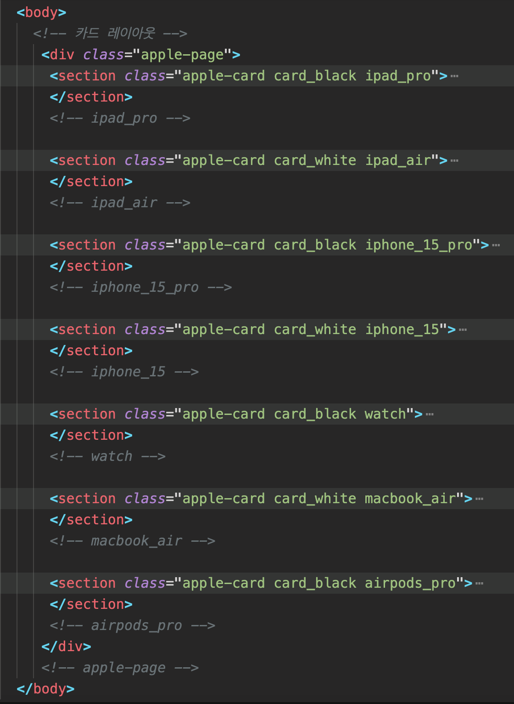
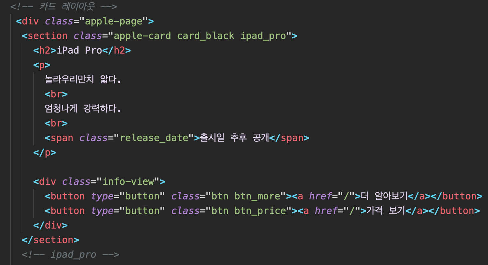
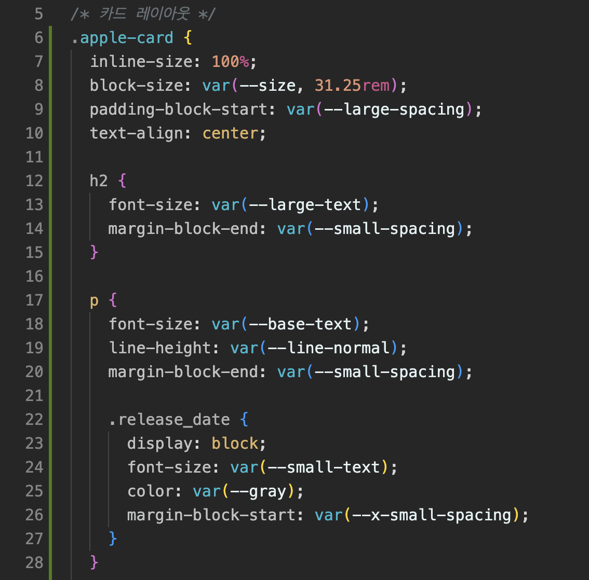
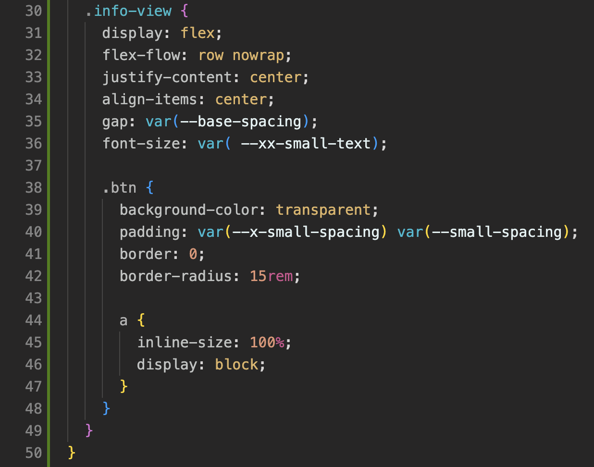
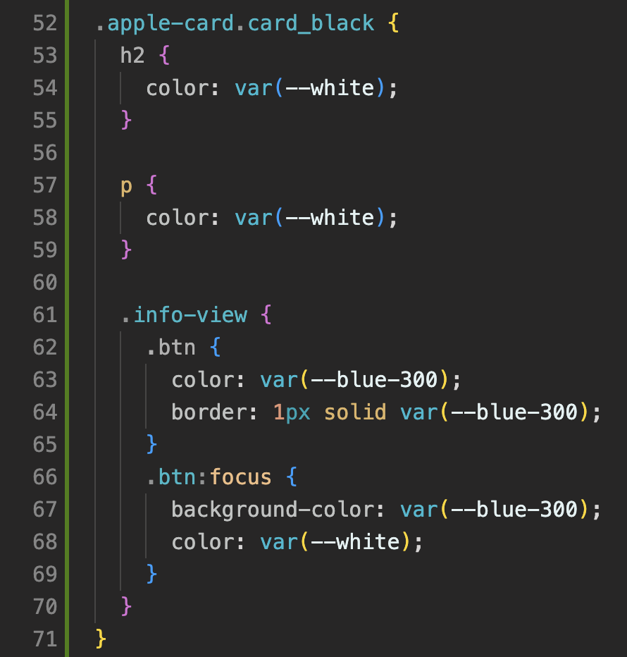
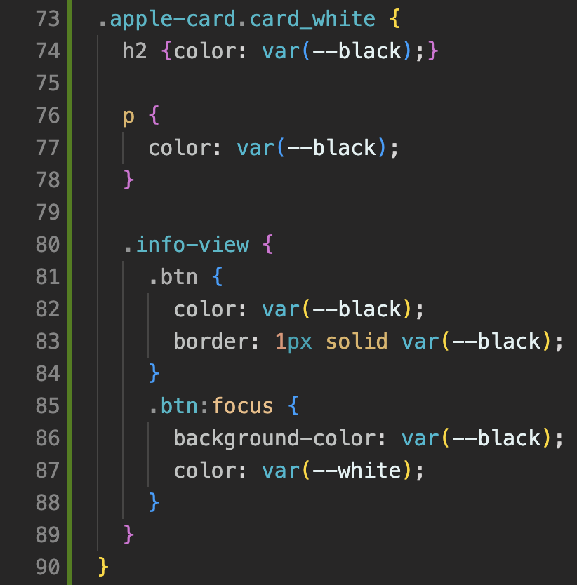
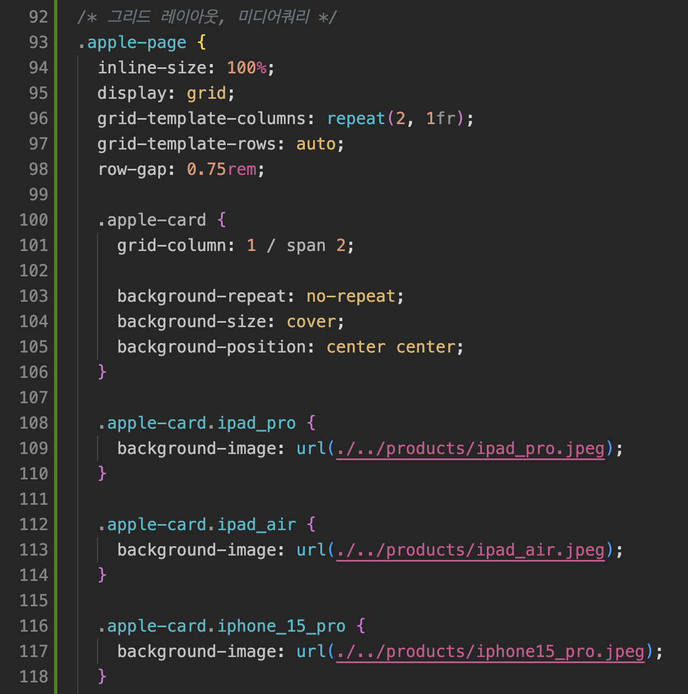
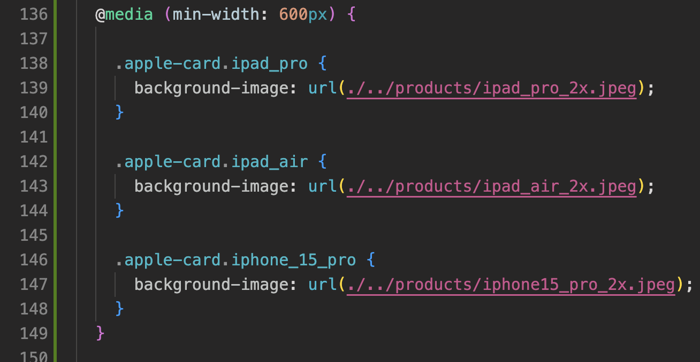
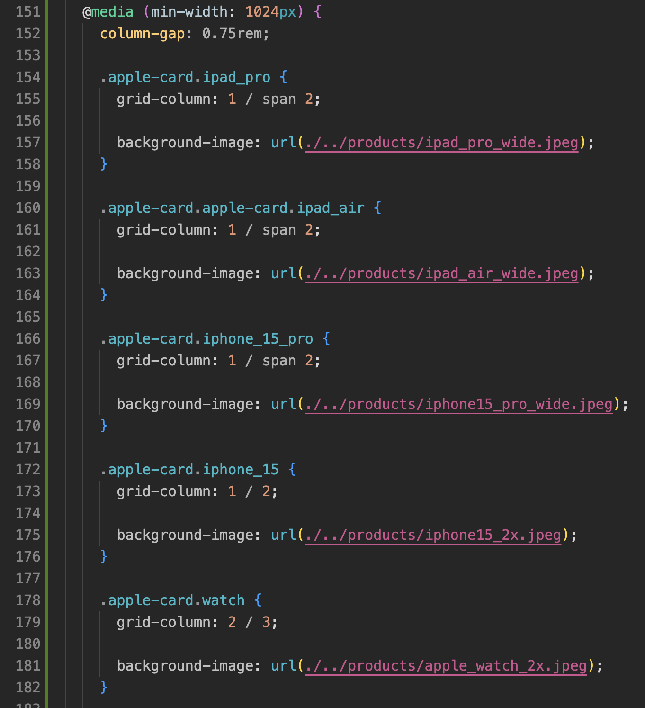
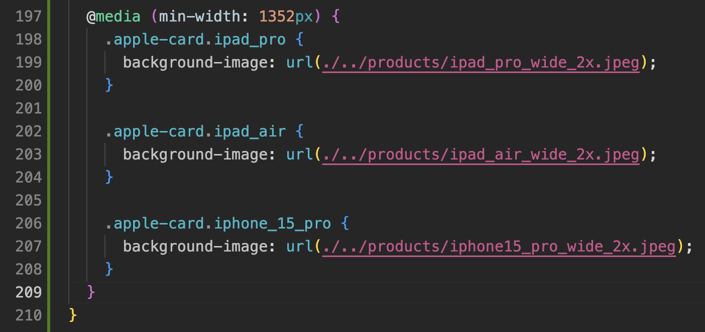

# apple 레이아웃 과제

---

▶️ homwork 저장소 배포 주소 :

### - apple 마크업
이번 과제를 하면서 마크업 부분에서는 딱히 어려움이 없었던 것 같습니다.  
마크업을 하면서 공통적으로 스타일이 들어가는 곳에는 같은 클래스를 같이 넣어 주었고, 클래스 이름을 고민하면서 마크업을 완성했습니다.  

전체적으로 div 태그 안에 section 태그로 각 애플 제품 카드 컴포넌트를 넣었습니다. 각 컴포넌트는 검은색 배경과 햐얀색 배경에서 글자 색상과 버튼 색상이 다르기 때문에 이를 고려하여 배경별로 클래스를 더 넣어주었습니다.

카드 컴포넌트 마크업은 section 태그 안에 h2 태그로 제목, p 태그로 부제목, span 태그로 출시일을 만들었고, div 태그로 button 태그들을 감쌌습니다.

### - apple 제품 카드 스타일  
카드 스타일은 인라인 사이즈와 블록 사이즈를 지정해주었고, 위쪽 여백값과 함께 텍스트 가운데 정렬을 헸습니다. span 태그는 블록요소로 바꾸고 스타일을 넣었습니다.
버튼 태그들의 부모요소인 .info-view에게 플렉스를 사용해 버튼들을 정렬했습니다. 버튼 태그 안에 a요소는 블록요소로 바꾸고 넓이를 100%로 지정해주었습니다.

  

카드 블랙과 화이트를 구분해서 각각 글자색과 버튼 스타일을 넣어주었다.

### - apple 반응형 레이아웃 스타일 (그리드, 미디어쿼리)  
전체를 카드 컴포넌트들을 묶는 .apple-page에 그리드를 적용하여 2열를 같은 넓이로 만들고 행은 오토로 지정해주었다. 처음 모바일 사이즈에서는 카드들이 한 줄로 보일수 있게 모든 .apple-card에 가로로 전체 칸을 차지하게 했고 공통적인 백그라운드 속성들을 넣었습니다.  
각각의 카드들에게 백그라운드 이미지를 넣어주었습니다.
  
  

미디어 커리로 화면의 최소 넓이가 600px 이상일 때, 2배율 이미지로 바뀌게 했습니다.

화면의 최소 넓이가 1024px일 때, 세번째 카드까지는 그대로 보이도록 하고 나머지 4개의 카드들은 2행 2열이 되도록 했습니다.

화면의 최소 넓이가 1352px일 때, 와이드 2배율 이미지로 바뀌게 했습니다.

  

### 📝 과제를 마치며...😂
화면에서 보이는 것은 과제 영상처럼 비슷하게 보이도록 구현했지만, 제가 올바르게 한 것인지 확신이 들지 않습니다.. 선생님께서 정답은 없고 여러 방법이 있다고 하셨지만, 여러 방법들 중에서 제 방법이 문법에 맞는지 성능에 문제는 없는지 잘 모르겠습니다. 
